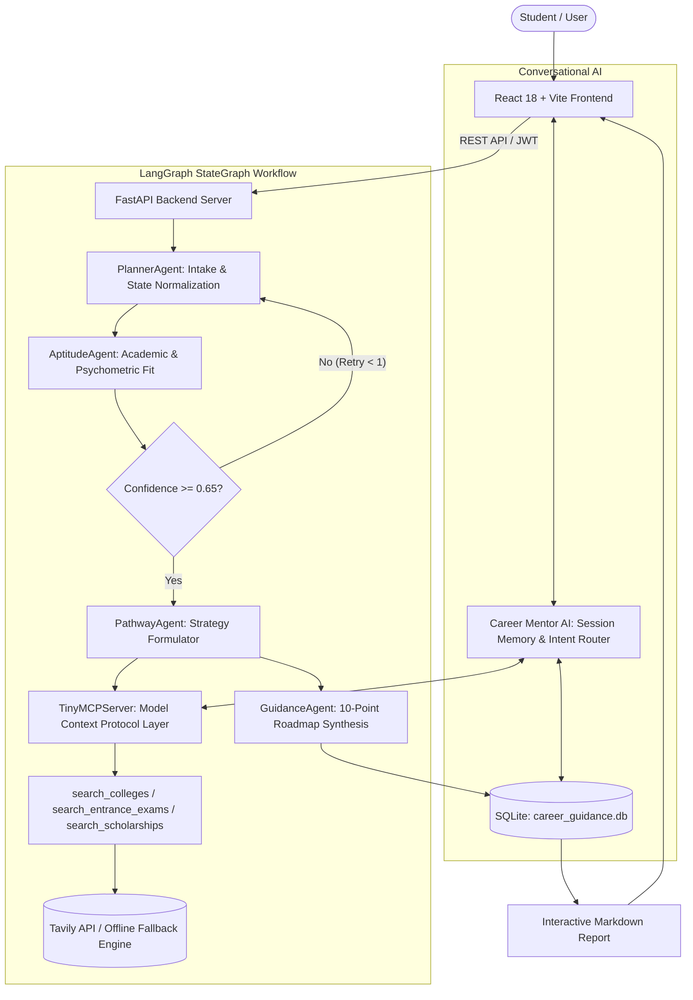

# CareerPilot AI — AI-Based Career Guidance Assistant for 12th Pass Students

> An agentic, multi-stream career navigation platform designed for Class 12 graduates (PCM, PCB, Commerce, Arts). Built with **LangGraph**, **Groq Llama-3.3-70B / Qwen**, **Model Context Protocol (MCP)**, **Tavily Search Grounding**, **FastAPI**, and **React + Vite**.

---

## Project Overview

**CareerPilot AI** bridges the gap between high school completion and undergraduate career strategy. Instead of generic single-prompt advice, CareerPilot uses an **orchestrated multi-agent architecture** that conducts personalized aptitude evaluation, queries verified official entrance exams and colleges via an MCP tool layer, verifies budget constraints, and generates an exhaustive, actionable 4-year career roadmap.

### Core Capabilities
- **Multi-Agent Orchestration**: Specialized agents (`PlannerAgent`, `AptitudeAgent`, `PathwayAgent`, `GuidanceAgent`, `Career Mentor`) collaborating over a shared Blackboard state.
- **Conditional Routing with LangGraph**: Automatically loops back to profile refinement if the aptitude confidence score drops below 0.65.
- **Model Context Protocol (MCP) Server**: Integrates a `TinyMCPServer` exposing educational research tools (`search_colleges`, `search_entrance_exams`, `search_scholarships`) grounded in real-time web data with offline fallback.
- **Conversational Career Mentor**: Context-aware AI counsellor with session memory, answering follow-up queries, explaining decisions, and routing student queries dynamically.
- **Production-Grade Auth**: Salted password hashing with `passlib[bcrypt]` and cryptographically signed 24-hour JSON Web Tokens (`PyJWT`).
- **Modern Responsive UI**: React 18 + Vite frontend with Tailwind CSS, Outfit & Manrope typography, GSAP micro-animations, and Lenis smooth scrolling.

---

## System Architecture



---

## Directory Structure

```text
.
├── backend/                  # FastAPI web server, multi-agent engine, and database
│   ├── careerpilot_agent_library.py # Core agent library, MCP server, LangGraph pipeline
│   ├── main.py               # REST API endpoints, JWT auth, and CORS
│   ├── requirements.txt      # Python dependencies
│   ├── .env                  # Active environment variables (API keys, secrets)
│   ├── .env.example          # Environment template
│   └── test_auth_jwt.py      # Automated auth verification test suite
│
├── frontend/                 # React 18 + Vite Single Page Application
│   ├── src/
│   │   ├── components/       # Assessment steps, navbar, footer, mentor modal
│   │   ├── pages/            # Home, Assessment, Report, Auth, NotFound
│   │   ├── services/         # API client with token management
│   │   ├── context/          # Auth context with 60-min auto-logout
│   │   └── hooks/            # Custom UI and idle activity hooks
│   ├── package.json          # Node dependencies and build scripts
│   └── vite.config.js        # Vite configuration
│
└── README.md                 # Root documentation (this file)
```

---

## Quick Start Guide

### Prerequisites
- **Python**: 3.10+ (tested through 3.14)
- **Node.js**: 18.0+ and npm
- **API Keys** (optional, offline mode works out of the box):
  - [Groq API Key](https://console.groq.com)
  - [Tavily Search API Key](https://tavily.com)

---

### 1. Backend Setup

```bash
# Navigate to backend directory
cd backend

# Install dependencies
pip install -r requirements.txt

# Configure environment variables
# (Copy .env.example to .env and configure your keys)
cp .env.example .env

# Start the FastAPI server
python -m uvicorn main:app --host 127.0.0.1 --port 8000
```
Backend will be live at: `http://127.0.0.1:8000`  
API Swagger Docs: `http://127.0.0.1:8000/docs`

---

### 2. Frontend Setup

```bash
# In a separate terminal, navigate to frontend directory
cd frontend

# Install Node dependencies
npm install

# Start the Vite development server
npm run dev
```
Frontend will be live at: `http://localhost:5173`

---

## Interactive Demonstration Mode

For project inspection, evaluation, or offline demonstrations, you can run the interactive CLI demo directly:

```bash
cd backend
python careerpilot_agent_library.py
```

This presents a terminal selection menu:
1. **Candidate Track 1**: Class 12 PCM (Engineering, Computing & AI)
2. **Candidate Track 2**: Class 12 PCB (Medicine, Biotechnology & Healthcare)
3. **Candidate Track 3**: Class 12 Commerce (Finance, Markets & CA)
4. **Candidate Track 4**: Class 12 Arts (Law, Policy & Design)
5. **Custom Profile**: Interactive input prompt

It executes the full LangGraph workflow, displays boot-time MCP tool registration, prints the Blackboard trace log, and renders the synthesized Markdown report.

---

## Deployment Strategy

The recommended production deployment follows the standard **decoupled architecture**:

| Component | Platform | Configuration |
| :--- | :--- | :--- |
| **Frontend** | [Vercel](https://vercel.com) or [Netlify](https://netlify.com) | Root: `frontend/`<br>Build: `npm run build`<br>Output: `dist`<br>Env: `VITE_API_BASE_URL=https://your-backend.onrender.com` |
| **Backend** | [Render](https://render.com) or [Railway](https://railway.app) | Root: `backend/`<br>Runtime: Python 3<br>Start: `uvicorn main:app --host 0.0.0.0 --port $PORT`<br>Env: `GROQ_API_KEY`, `TAVILY_API_KEY`, `JWT_SECRET` |

---

## License

This project is developed for educational and career guidance purposes. All rights reserved.
